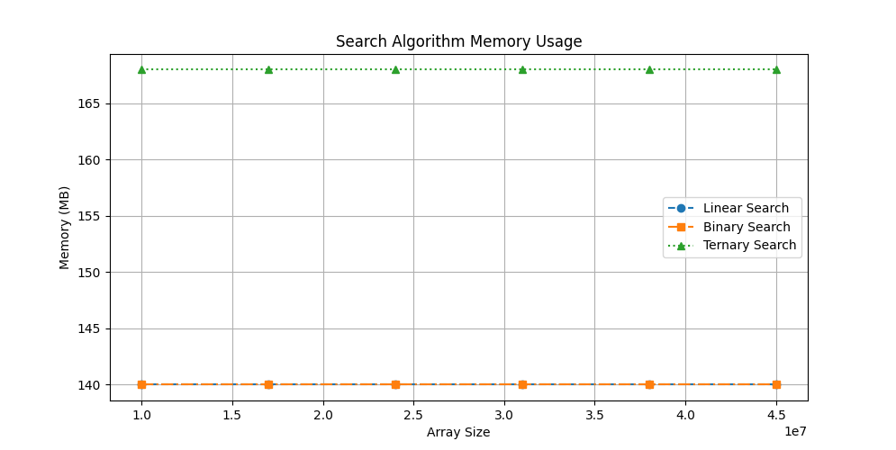
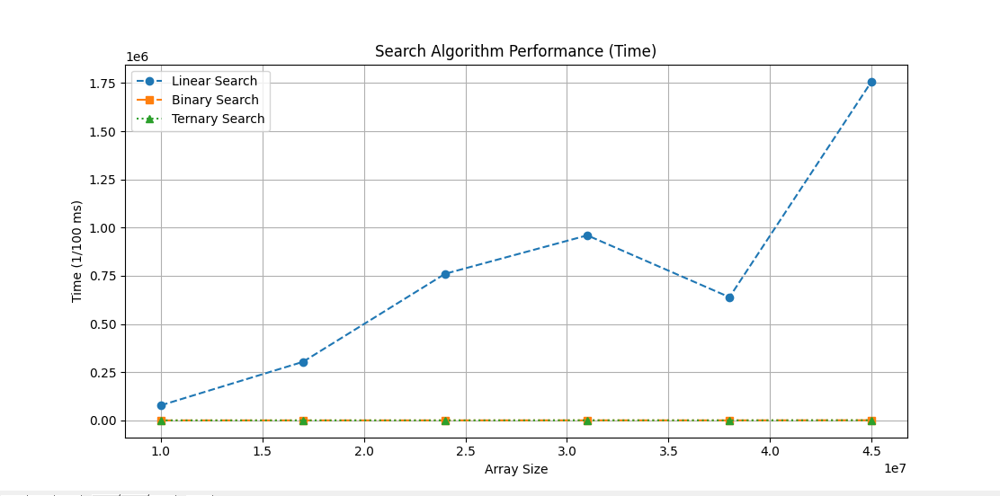
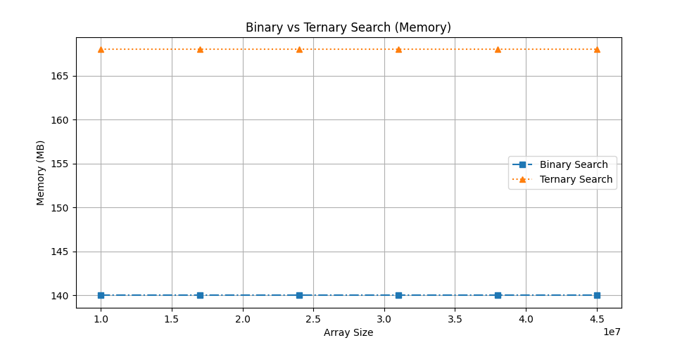
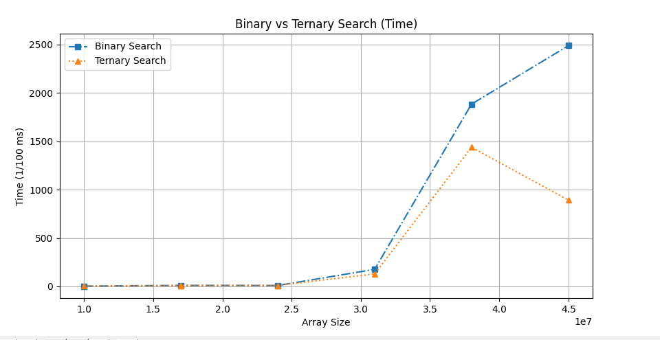
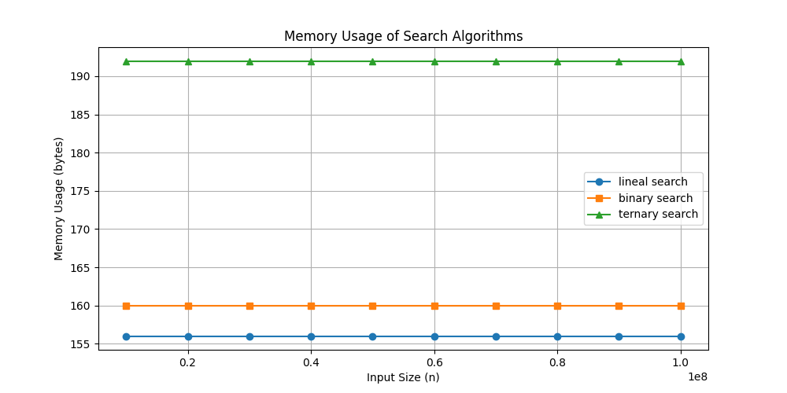
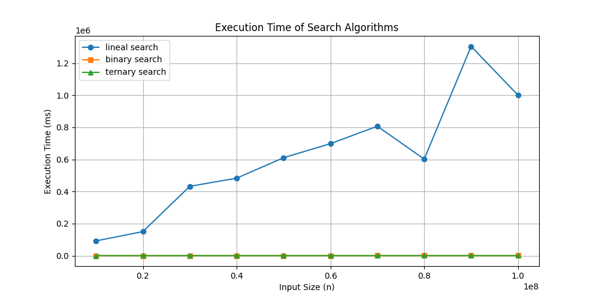
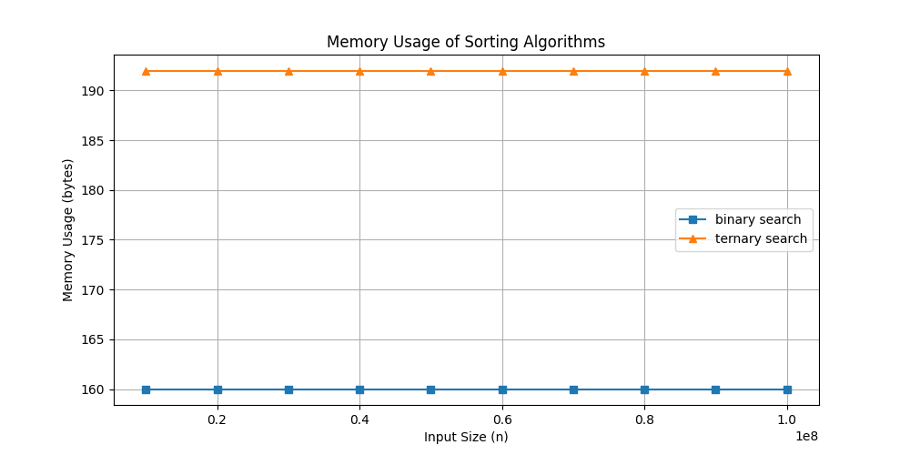
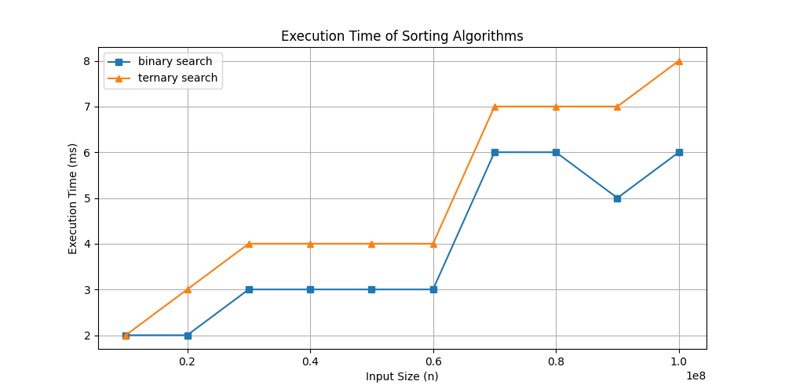

# ALDA_M – Algorithm Analysis  
## Category: Shortest Path  
**Language:** Python  
**Name:** Santiago Coronado Pinzón  

---

# Searching Algorithms

## Introduction

Searching algorithms are fundamental in computer science because they allow efficient data retrieval and processing. Selecting the appropriate searching technique significantly impacts performance, especially when working with large datasets.

This project analyzes and compares three widely used searching algorithms:

- Linear Search  
- Binary Search  
- Ternary Search  

The study evaluates their theoretical complexity, practical performance, scalability, and memory usage using large arrays ranging from 10 million to 100 million elements.

---

# 1. Linear Search

## Description

Linear Search is a simple sequential searching method. It checks each element in the list one by one until the target value is found or the list ends.

It does not require the array to be sorted.

## Algorithm Steps

1. Start from the first element.
2. Compare the current element with the target.
3. If they match, return the position.
4. Otherwise, move to the next element.
5. Repeat until the end of the list.
6. If not found, return failure.

---

# 2. Binary Search

## Description

Binary Search is an efficient divide-and-conquer algorithm that works only on sorted arrays. It repeatedly divides the search interval in half.

## Algorithm Steps

1. Find the middle element of the array.
2. If it equals the target, return its position.
3. If the target is smaller, search the left half.
4. If the target is larger, search the right half.
5. Repeat until found or the interval becomes empty.

---

# 3. Ternary Search

## Description

Ternary Search is another divide-and-conquer algorithm similar to Binary Search. Instead of dividing the array into two parts, it divides it into three segments.

## Algorithm Steps

1. Calculate two midpoints dividing the array into three parts.
2. If either midpoint equals the target, return its position.
3. If the target is smaller, search the left segment.
4. If it lies between midpoints, search the middle segment.
5. If it is larger, search the right segment.
6. Repeat until found or empty.

---

# Time Complexity Comparison

| Algorithm       | Best Case | Worst Case | Average Case |
|-----------------|-----------|------------|--------------|
| Linear Search   | O(1)      | O(n)       | O(n)         |
| Binary Search   | O(1)      | O(log₂ n)  | O(log₂ n)    |
| Ternary Search  | O(1)      | O(log₃ n)  | O(log₃ n)    |

---

## Coverage

Make sure you have "coverage" in your requirements.txt file and run pip install. Then run `python -m coverage run -m unittest discover` and after that run `python -m coverage report` to get the following table:
```
Name                          Stmts   Miss  Cover
-------------------------------------------------
array_search\algorithms.py       36      2    94%
data\constants.py                 2      0   100%
data\data_generator.py            6      1    83%
test\test_algorithms.py          20      1    95%
test\test_data_generator.py      29      1    97%
-------------------------------------------------
TOTAL                            93      5    95%
```

---
# Search Algorithm Comparison

## Table 1: Comparison of Linear, Binary, and Ternary Search

| Size      | Linear Search (Time, Mem) | Binary Search (Time, Mem) | Ternary Search (Time, Mem) |
|-----------|---------------------------|---------------------------|---------------------------|
| 10,000,000  | [77,905, 140]  | [5, 140]    | [6, 168]    |
| 17,000,000  | [303,747, 140] | [16, 140]   | [59, 168]   |
| 24,000,000  | [760,657, 140] | [102, 140]  | [108, 168]  |
| 31,000,000  | [960,082, 140] | [317, 140]  | [403, 168]  |
| 38,000,000  | [639,279, 140] | [164, 140]  | [109, 168]  |
| 45,000,000  | [1,759,064, 140] | [748, 140] | [650, 168]  |

---
### Memory Usage


### Execution Time


## Table 2: Comparison of Binary and Ternary Search

| Size      | Binary Search (Time, Mem) | Ternary Search (Time, Mem) |
|-----------|---------------------------|---------------------------|
| 10,000,000  | [3, 140]    | [4, 168]    |
| 17,000,000  | [10, 140]   | [9, 168]    |
| 24,000,000  | [9, 140]    | [10, 168]   |
| 31,000,000  | [176, 140]  | [129, 168]  |
| 38,000,000  | [1,884, 140] | [1,438, 168] |
| 45,000,000  | [2,488, 140] | [892, 168]  |

---
### Memory Usage


### Execution Time


# Search Algorithm Comparison 2
## Table 1: Comparison of Linear, Binary, and Ternary Search between 10M - 100M size of arrays
| Size       | Linear Search (Time, Mem) | Binary Search (Time, Mem) | Ternary Search (Time, Mem) |
|------------|---------------------------|---------------------------|----------------------------|
| 10,000,000  | (92,007, 156)   | (2, 160)   | (2, 192)   |
| 20,000,000  | (149,990, 156)  | (2, 160)   | (3, 192)   |
| 30,000,000  | (432,263, 156)  | (2, 160)   | (3, 192)   |
| 40,000,000  | (482,886, 156)  | (2, 160)   | (3, 192)   |
| 50,000,000  | (610,437, 156)  | (2, 160)   | (3, 192)   |
| 60,000,000  | (698,339, 156)  | (2, 160)   | (3, 192)   |
| 70,000,000  | (806,653, 156)  | (3, 160)   | (4, 192)   |
| 80,000,000  | (601,958, 156)  | (4, 160)   | (5, 192)   |
| 90,000,000  | (1,304,798, 156) | (4, 160)   | (5, 192)   |
| 100,000,000 | (1,000,406, 156) | (3, 160)   | (6, 192)   |
### Memory Usage


### Execution Time


## Table 2: Comparison of Binary and Ternary Search between 10 - 100M size of arrays
| Size       | Binary Search (Time, Mem) | Ternary Search (Time, Mem) |
|------------|---------------------------|----------------------------|
| 10,000,000  | (2, 160)   | (2, 192)   |
| 20,000,000  | (2, 160)   | (3, 192)   |
| 30,000,000  | (3, 160)   | (4, 192)   |
| 40,000,000  | (3, 160)   | (4, 192)   |
| 50,000,000  | (3, 160)   | (4, 192)   |
| 60,000,000  | (3, 160)   | (4, 192)   |
| 70,000,000  | (6, 160)   | (7, 192)   |
| 80,000,000  | (6, 160)   | (7, 192)   |
| 90,000,000  | (5, 160)   | (7, 192)   |
| 100,000,000 | (6, 160)   | (8, 192)   |


### Memory Usage


### Execution Time


# Conclusions

## Performance Behavior

The experimental results confirm the theoretical complexity of each algorithm.

Linear Search shows a direct increase in execution time as the dataset grows, consistent with its **O(n)** complexity. It becomes inefficient for large-scale arrays.

Binary Search and Ternary Search maintain very low execution times even for extremely large inputs due to their logarithmic complexity.

---

## Binary vs Ternary Search

Although Ternary Search reduces the search space into three parts, Binary Search performs better in practice.

### Reasons:

- Fewer comparisons per iteration.
- Lower computational overhead.
- Simpler implementation.

The theoretical improvement from **log₃(n)** does not compensate for the additional operations required.

Binary Search consistently shows better execution time and lower memory usage.

---

## Memory Usage

Memory consumption remains nearly constant regardless of input size.

- Linear Search uses slightly less memory.
- Binary Search uses less memory than Ternary Search.
- Differences are minimal compared to execution time differences.

Time complexity has a much greater impact on performance than memory usage in this case.

---

## Scalability

From 10 million to 100 million elements:

- Linear Search does not scale efficiently.
- Binary and Ternary Search demonstrate excellent scalability.
- Logarithmic growth ensures stable performance even for massive datasets.

---

## Final Conclusion

Based on both theoretical analysis and empirical results:

- Linear Search is suitable for small or unsorted datasets.
- Binary Search is the most efficient and practical algorithm for large sorted arrays.
- Ternary Search maintains logarithmic complexity but does not outperform Binary Search in real implementations.

Binary Search is therefore the recommended algorithm for large sorted datasets due to its optimal balance between efficiency, simplicity, and memory usage.

---

## Use of Artificial Intelligence

In accordance with course policy, Artificial Intelligence was used for:

- Assisting in documentation formatting.
- Improving clarity and structure of explanations.
- Supporting test generation guidance.

All algorithm implementations, performance experiments, and analysis were conducted and validated by:

**Santiago Coronado Pinzón**
